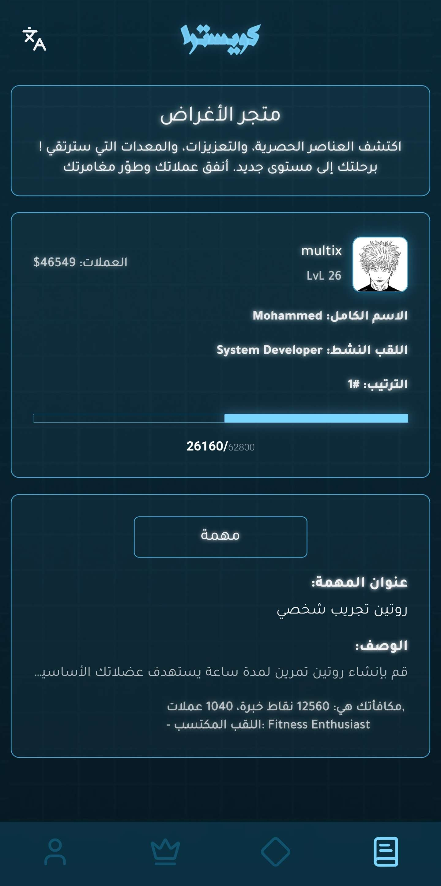
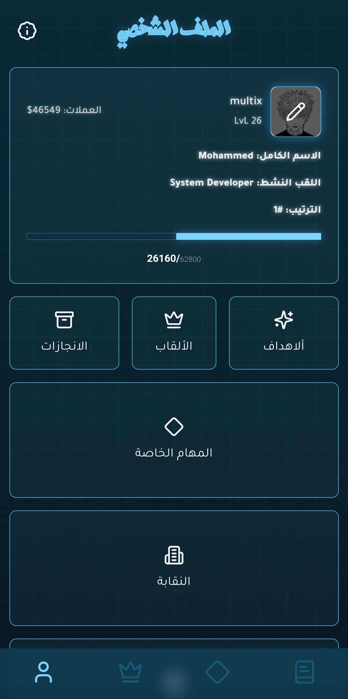
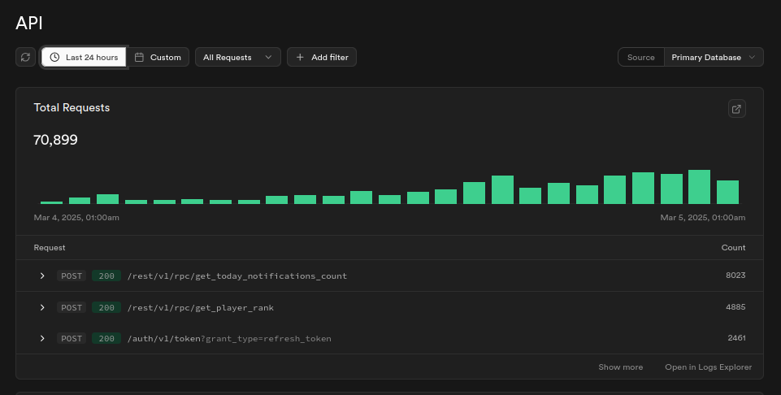
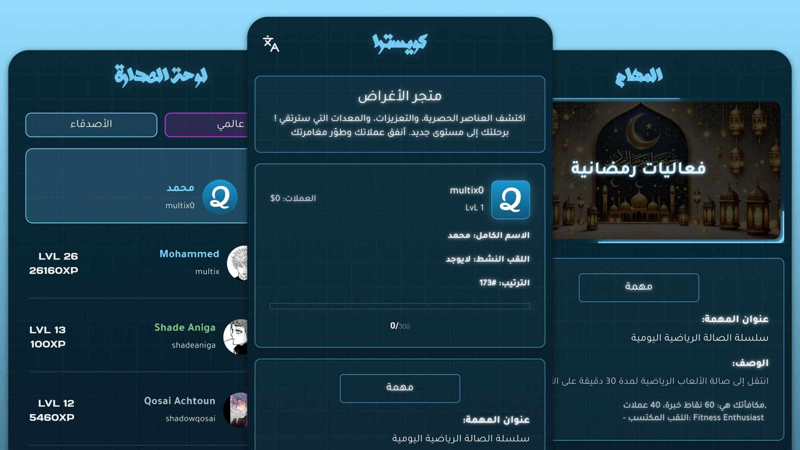

  

<h1 align="center">Questra</h1>

  <b>An AI-driven quest platform that turns personal goals into tailored challenges — motivating, adaptive, and direct.</b>

  <a href="#overview">Overview</a> •
  <a href="#features">Features</a> •
  <a href="#screenshots">Screenshots</a> •
  <a href="#backend-architecture">Backend Architecture</a> •
  <a href="#tech-stack">Tech Stack</a> •
  <a href="#statistics">Statistics</a> •
  <a href="#vision">Vision</a>

---

## Overview

Questra is a gamified productivity platform that issues AI-generated, context-aware quests tailored to each user’s goals, history, and feedback. It combines behavioral design with adaptive AI to keep users engaged with realistic, time-aware challenges — delivered in both English and Arabic.

The product has real traction: more than **2,000 users** and **500+ daily active users** at peak usage.

---

## Features

### Personalized AI Quests
- Adaptive quest generation based on user history, preferences, and past completions.  
- Strict JSON quest output for reliable backend processing and auditing.  
- Leveling, achievements, and rare title assignments to reward meaningful progress.

### Motivation Engine
- Direct, attention-grabbing notifications designed to re-engage users.  
- Fine-grained control of response frequency and notification logic to avoid fatigue.  

### Community & Moderation
- Reporting system for cheating, false claims, and poor-proof submissions.  
- Layered moderation combining automated checks and manual review.

### Localization
- Full bilingual support (English and Arabic) with `.arb` resource files for UI and content.  
- Automatic locale handling and contextual content generation per language.

---

## Screenshots

  
  
  
  
  

---

## Backend architecture

Questra uses **Supabase** as its primary backend and database layer. Supabase provides the core storage, authentication, and realtime capabilities; specialized services (Go backend and Node.js microservices) handle business logic, AI orchestration, and embedding/vector workflows.

Key elements:
- **Supabase (Primary Database & Realtime):** Stores users, quests, reports, titles, and activity logs. Realtime features power live updates and notifications across clients.  
- **Go Services:** Core application logic, API endpoints that validate and coordinate user actions, and background workers for persistence and analytics.  
- **Node.js Microservices:** Responsible for AI-related tasks — quest generation, embedding creation, moderation analysis, and any LLM orchestration.  
- **Supabase Edge Functions / REST endpoints:** Lightweight serverless functions are used for actions that need to run close to the database (when applicable) and to reduce latency for critical flows.  
- **Caching & Queueing:** Short-term caches and background queues ensure consistent performance during bursts of activity and heavy AI computation.

The included screenshot demonstrates our API request flow and runtime performance metrics as observed during typical load. It illustrates how Supabase interacts with the application services and how requests move through the system.

  

---

## Tech Stack

| Layer | Technology |
|-------|-------------|
| **Client** | Flutter |
| **Primary Backend / DB** | Supabase (Postgres, Auth, Realtime, Storage) |
| **Application Services** | Go (core logic, workers) |
| **AI / Embedding Services** | Node.js (LLM orchestration, embeddings) |
| **Hosting / Functions** | Supabase Edge Functions, containerized services where applicable |

---

## Statistics

| Metric | Value |
|--------|-------|
| Total users (historical) | 2,000+ |
| Daily Active Users (peak) | 500+ |
| Supported languages | English, Arabic |
| Codebase size | 22,000+ lines of code |

---

## Security & Privacy

- Users authenticate through Supabase Auth; session management and refresh flows follow best practices.  
- Personal data and messages are stored in Postgres with access controls; sensitive operations are validated server-side.  
- Reporting and moderation pipelines are designed to prevent abuse and protect user privacy.

---

## Vision

Questra is built to be more than a productivity app — it’s a persistent companion for personal growth. By combining honest, adaptive AI with social accountability and fair progression systems, Questra turns habit-building into a sustainable, measurable journey.

---

  

---

  Questra — designed and shipped with attention to growth, reliability, and user experience.

